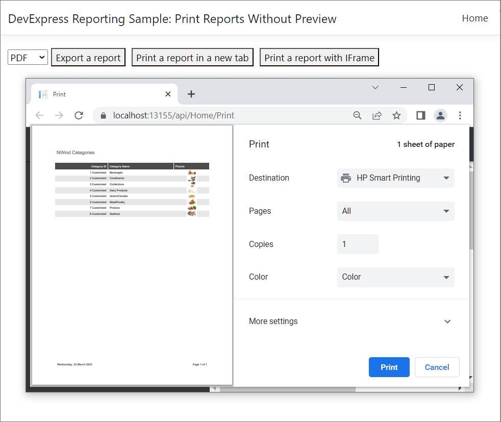

<!-- default badges list -->

<!-- default badges end -->
# Reporting for Angular - Print and Export Without Preview

This example prints and exports a report in a browser without previewing it on a web page.

## Printing

On the **server side**, add a controller action to:
- [create a report](https://docs.devexpress.com/XtraReports/2440/get-started-with-devexpress-reporting/create-a-report-from-a-to-z);
- [export the report to PDF](https://docs.devexpress.com/XtraReports/2574/detailed-guide-to-devexpress-reporting/store-and-distribute-reports/export-reports/export-to-pdf): you can do so asynchronously using the [XtraReport.ExportToPdfAsync](https://docs.devexpress.com/XtraReports/DevExpress.XtraReports.UI.XtraReport.ExportToPdfAsync.overloads) method;
- send back to the client.

On the **client-side**, two options are available:

* Print a report in a new tab.
Create a print button and invoke a new tab by using the client-side `window.Open(url, "_blank")` method to open a new tab and allow clients to print a document.

* Print a report with iFrame. 
Once a client clicks the print button, invoke the browser's Print dialog in the `HTMLIFrameElement` so that users can proceed with printing the document.

## Exporting

Create a server-side controller action to export a report to a format selected by a user.

## Files to Look At

- [home.component.html](ClientApp/src/app/home/home.component.html)
- [home.component.ts](ClientApp/src/app/home/home.component.ts)
- [HomeController.cs](Controllers/HomeController.cs)

## Documentation

* [Print and Export in Angular Application](https://docs.devexpress.com/XtraReports/401842/web-reporting/javascript-reporting/angular/print-and-export)
* [Export Reports](https://docs.devexpress.com/XtraReports/1302/detailed-guide-to-devexpress-reporting/store-and-distribute-reports/export-reports).

## More Examples

- [How to Print and Export a Report in the ASP.NET Core Application without the Document Viewer](https://github.com/DevExpress-Examples/Reporting-AspNetCore-Print-Without-Preview)
- [Reporting for ASP.NET MVC - How to print or export a report without showing a preview](https://github.com/DevExpress-Examples/reporting-print-export-report-without-showing-a-preview)
- [Reporting for ASP.NET WebForms - How to print or export a report without showing a preview](https://github.com/DevExpress-Examples/reporting-webforms-print-export-report-without-showing-a-preview)
<!-- feedback -->
## Does this example address your development requirements/objectives?

 

(you will be redirected to DevExpress.com to submit your response)
<!-- feedback end -->
